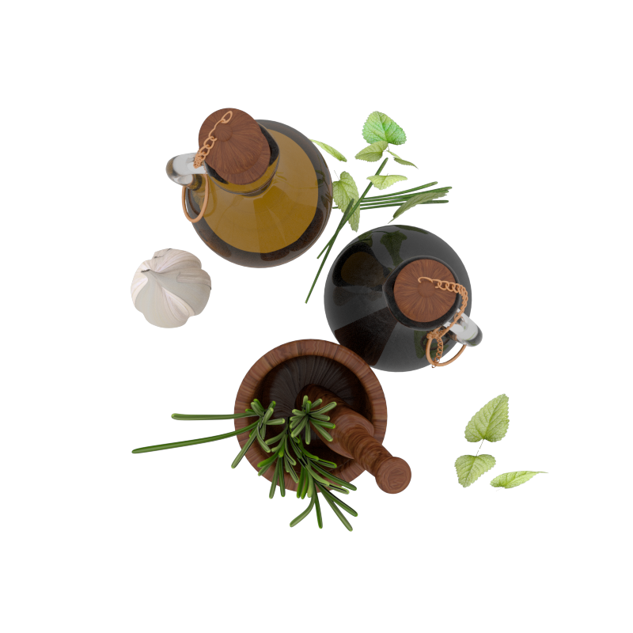
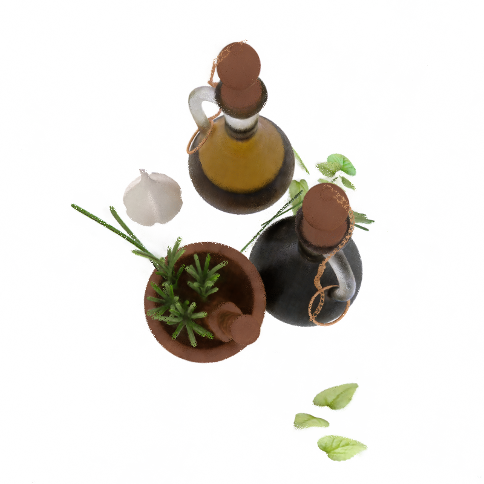

# NeRF on Bottles
This is the final project for my CSE 291: Machine Learning for 3D Geometry at UCSD, in which I reproduced Neural Radiance Fields (NeRF) on the bottles dataset. The code is implemented with reference to https://github.com/airalcorn2/pytorch-nerf.

## Usage
To train, edit the hyperparmeters in `run_nerf.py` and run it. After training is complete, run `predict.py` to generate the rgb maps and depth maps of five novel views in `result` folder. The folder already contains results I attained by training the model for ~1 day on RTX 3060.

## Model
The model in this project is a faithful implementation of the NeRF model in the original paper. 

## Results
### Training and Test Settings
The model is trained for 250k iterations in total, which took about 20 hours on RTX 3060. In the official NeRF code, they used a batch size (number of random rays samples every iteration) of $32 \times 32$ when training on the 400x400 images. I used a batch size of $48 \times 48$ aiming for better convergence on 800x800 images. I used the Adam optimizer with learning rate 5e-4, and gradually decay the learning rate to 5e-5 throughout the whole training process (similar to the original paper).

### Results
An example groundtruth image from the test set:

Prediction of the model of a novel view:

There are still some noises and the non-lambertian material is not perfectly reproduced. According to the feedback of my final project, the average PSNR of the 5 novel views is 28.85.
